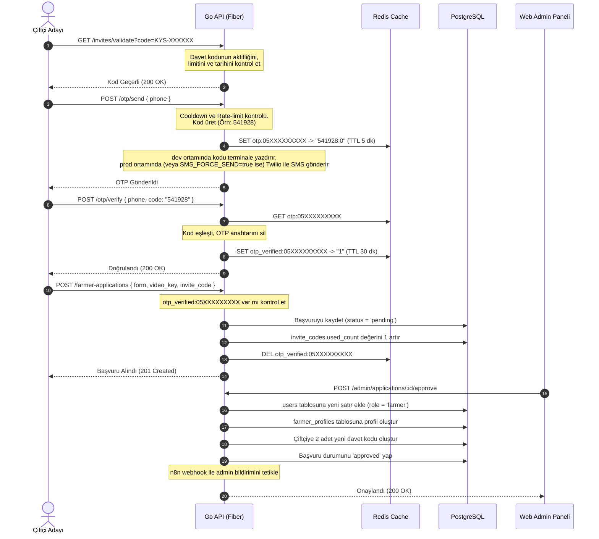

# Köyden Şehire — Kimlik Doğrulama & OTP Akışı

Bu doküman, **Köyden Şehire** platformunun iki aşamalı kimlik doğrulama sistemini (OTP + JWT), token yenileme (Refresh) mantığını ve kullanıcı kayıt/giriş akışlarını detaylıca açıklar.

---

## 1. Genel Bakış

Platformda iki tür yetkilendirme katmanı bulunur:
1. **OTP Telefon Doğrulaması:** Müşteri kaydı, çiftçi başvurusu gibi hassas işlemlerden önce telefon numarasının doğruluğunu garanti altına almak için zorunludur.
2. **JWT Bearer Token:** Sisteme başarıyla giriş yapan ve aktif olan kullanıcıların (Farmer, Admin, Customer) sonraki API isteklerini yetkilendirmek için kullanılır.

---

## 2. OTP (Tek Kullanımlık Şifre) Mekanizması

OTP durumları veritabanında değil, yüksek erişim hızı ve otomatik zaman aşımı (TTL) desteği sunan **Redis** üzerinde tutulur.

### Redis Anahtar (Key) Yapısı

* **`otp:{phone}`**
  - **Değer:** `"KOD:DENEME_SAYISI"` (Örn: `"748291:0"`)
  - **TTL (Ömür):** 300 saniye (5 dakika). Bu süre sonunda kod silinir.
  - **Kural:** Her doğrulama denemesinde deneme sayısı 1 artırılır. Deneme sayısı 3'e ulaştığında veya aşımında OTP anahtarı Redis'ten silinir (`MAX_ATTEMPTS` hatası).
* **`otp_verified:{phone}`**
  - **Değer:** `"1"`
  - **TTL (Ömür):** 1800 saniye (30 dakika).
  - **Amaç:** OTP doğrulaması başarıyla tamamlandığında bu anahtar oluşturulur. İstemcinin asıl kayıt/başvuru isteğini göndermek için 30 dakikalık bir penceresi vardır. İşlem başarıyla tamamlandığında bu bayrak Redis'ten silinir (tek kullanımlıktır).
* **`otp_send_cooldown:{phone}`**
  - **Değer:** `"1"`
  - **TTL (Ömür):** 60 saniye (veya yapılandırılan cooldown süresi).
  - **Amaç:** Aynı telefon numarasına üst üste OTP kodu gönderilmesini engeller (`COOLDOWN_ACTIVE` hatası).

---

## 3. JWT & Refresh Token Rotasyonu

Kullanıcı `POST /auth/login` isteği gönderdiğinde sunucu iki token döner: `access_token` (JWT) ve `refresh_token` (Kriptografik Rastgele Hex).

### A. JWT Access Token Yapısı
JWT imzası yalnızca **HS256** (HMAC-SHA256) kullanılarak doğrulanır. Olası kütüphane açıklarını önlemek için imza doğrulama aşamasında algoritma eşleşmesi zorunlu tutulur (`WithValidMethods(["HS256"])`).

**Payload içeriği:**
```json
{
  "user_id": "9b1deb4d-3b7d-4bad-9bdd-2b0d7b3dcb6d",
  "role": "farmer",
  "exp": 1780760400,
  "iat": 1780674000
}
```
* **Ömür:** Varsayılan 24 saat (`JWT_ACCESS_TOKEN_EXPIRY` env ile yapılandırılabilir).

### B. Refresh Token Yapısı ve Rotasyonu
Refresh token bir JWT **değildir**. Sunucu tarafında `crypto/rand` paketinden alınan 32 byte'lık güvenli rastgele verinin Hex string'e dönüştürülmesiyle elde edilen 64 karakterli bir anahtardır.

* **Redis Saklama Deseni:** `refresh_token:{token_string} -> {user_id}`
* **Rotasyon (Rotation) Akışı:**
  1. İstemci `POST /auth/refresh` endpoint'ine mevcut refresh token'ı gönderir.
  2. Sunucu bu token'ı Redis'te arar. Bulamazsa 401 Unauthorized hatası verir.
  3. Token geçerliyse, eski refresh token Redis'ten **derhal silinir** (tekrar kullanımı engellemek için).
  4. Yeni bir `access_token` ve yepyeni bir `refresh_token` çifti üretilerek Redis'e yazılır ve istemciye döndürülür.
  5. Bu sayede çalınan bir refresh token kullanıldığında, gerçek kullanıcının bir sonraki yenileme isteğinde çakışma tespit edilir ve oturum sonlandırılır.

---

## 4. Kullanıcı Akışları (Adım Adım)

### A. Çiftçi Başvuru Akışı
Çiftçiler platforma doğrudan kaydolamaz; bir davet zincirinden ve onay sürecinden geçmelidir.



### B. Müşteri Kayıt Akışı
Müşteriler davet koduna ihtiyaç duymaz, OTP doğrulamasının hemen ardından kaydolabilirler.

1. **OTP İsteme:** `POST /otp/send` ile telefona kod gönderilir.
2. **OTP Doğrulama:** `POST /otp/verify` ile kod doğrulanır ve Redis'te `otp_verified:{phone}` bayrağı oluşturulur.
3. **Kayıt:** `POST /auth/register/customer` endpoint'ine isim, şifre ve telefon gönderilir.
   - Sunucu, `otp_verified:{phone}` bayrağını doğrular ve tüketir (siler).
   - Şifre bcrypt (cost 12) ile hash'lenerek `users` tablosuna `role = 'customer'` ve `status = 'active'` olarak kaydedilir.
   - İstemciye doğrudan `access_token` ve `refresh_token` çifti dönülerek otomatik giriş yaptırılır.

---

## 5. Rate Limiting (Hız Sınırlama) Kuralları

Kaba kuvvet (brute-force) saldırılarını ve SMS maliyetlerini önlemek amacıyla endpoint düzeyinde Redis tabanlı kısıtlamalar uygulanır:

| Endpoint | Kapsam | Limit | Yenilenme Süresi | Hata Kodu |
| :--- | :--- | :--- | :--- | :--- |
| `POST /otp/send` | Telefon Başına | 3 İstek | 1 Saat | `RATE_LIMIT_EXCEEDED` |
| `POST /otp/send` | IP Başına (Tel yoksa) | 3 İstek | 1 Saat | `RATE_LIMIT_EXCEEDED` |
| `POST /auth/login` | Telefon Başına | 5 İstek | 15 Dakika | `RATE_LIMIT_EXCEEDED` |
| `POST /auth/login` | IP Başına | 30 İstek | 15 Dakika | `RATE_LIMIT_EXCEEDED` |
| `POST /auth/register/customer` | Telefon Başına | 3 İstek | 1 Saat | `RATE_LIMIT_EXCEEDED` |
| `GET /invites/validate` | IP Başına | 20 İstek | 1 Saat | `RATE_LIMIT_EXCEEDED` |

---

## Bağlantılı Dosyalar
- [03_DATABASE_SCHEMA.md](file:///c:/Projeler/koyden-sehire-mobil/docs/gemini/03_DATABASE_SCHEMA.md)
- [05_UPLOADS_AND_STORAGE.md](file:///c:/Projeler/koyden-sehire-mobil/docs/gemini/05_UPLOADS_AND_STORAGE.md)
- [AUTH_FLOW.md](file:///c:/Projeler/koyden-sehire-mobil/backend/docs/AUTH_FLOW.md)
